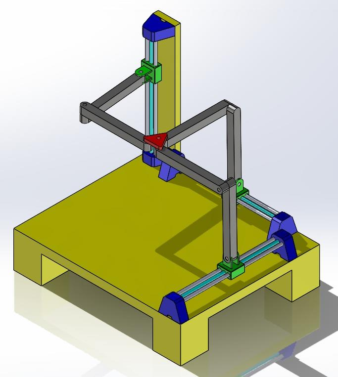
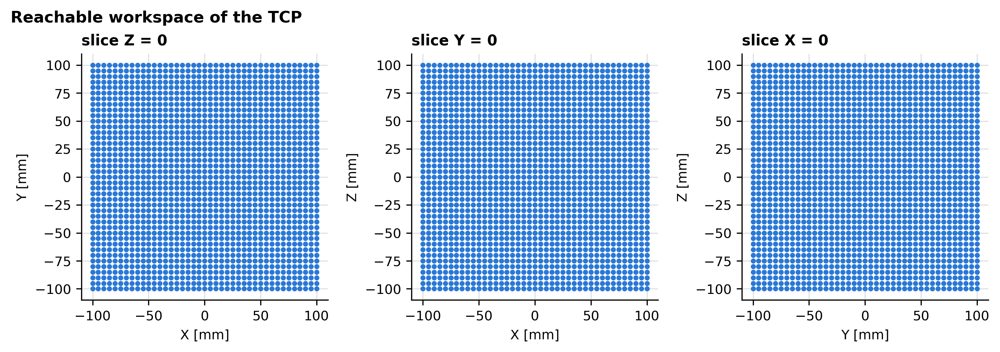
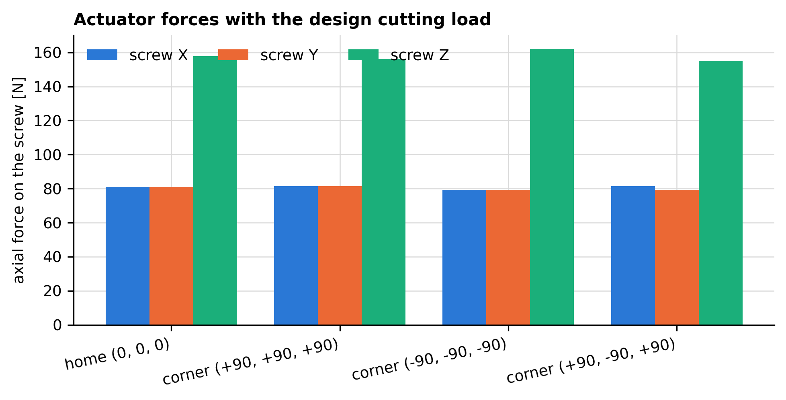

# Tripteron CNC Router — 3-PRRR Parallel Machining Table

Design, drawings and complete engineering verification of a three-degree-of-freedom
translational parallel machine (Tripteron) used as a CNC router.

**IM0240 Machine Design I — Universidad EAFIT, Mechanical Engineering**

**Authors:** David Amell Osorio · Germán Gabriel Riaño Barrera · David Zuluaga Henao
**Course lecturer:** Juan Andrés Gallego Sánchez

<p align="center">
  
  
</p>

---

## What this machine is

The Tripteron is a parallel manipulator with three identical **PRRR** legs: one prismatic
joint driven by a lead screw followed by three revolute joints with parallel axes. The
three prismatic axes are mutually orthogonal.

Its defining property is that it is **fully decoupled**: actuator *i* moves the tool along
axis *i* only, so the machine behaves like a cartesian router while being built as a
parallel mechanism. Its workspace is a perfect cube and its controller needs no coordinate
transformation. Both properties are proved numerically in the calculation report.

| Specification | Value |
|---|---|
| Degrees of freedom | 3 translations (no rotation) |
| Workspace | 200 mm cube — 8.615 dm³ |
| Link lengths | 240 mm (proximal and distal) |
| Stroke per axis | 200 mm |
| Feed rate | 10 mm/s |
| Cutting force (design) | [80, 80, −120] N |
| Drive | Ø8 mm trapezoidal lead screw, p = 2 mm, 4 starts (lead 8 mm) |
| Motor | NEMA 34 86HB250 closed loop, 4.5 N·m |
| Frame | Welded steel tube, alloy steel Sy = 620 MPa |

## Headline results

<p align="center">
  
</p>


| Verification | Result | Margin |
|---|---|---|
| Kinematic model | Newton–Raphson residual < 8·10⁻¹¹ mm | matches closed form to 10⁻¹³ mm |
| Design actuator load | **162.0 N** (worst pose, vertical axis) | varies only 4.5 % over the workspace |
| Arm bending stress | 26.1 MPa | SF 9.6 vs AISI 1020 |
| Lead screw, von Mises | 14.3 MPa | SF 25.8 |
| Lead screw, buckling | Pcr = 519.9 N (Euler) | **SF 3.21 — governing criterion** |
| Screw efficiency | 64.1 % | not self-locking → brake required on Z |
| Chassis FEA, stress | 9.36 MPa | SF 66 |
| Chassis FEA, deflection | 0.102 mm | the limiting number for accuracy |
| Chassis FEA, buckling | load factor 2238 | irrelevant at this load |

## Repository layout

```
01_Delivery1_Proposal/             Design proposal: requirements, PDS, architecture selection
02_Delivery2_Drawings/             Drawing package (English cover + index + 41 CAD sheets)
03_Delivery3_Calculation_Report/   Calculation report: kinematics, statics, screw, FEA
04_Calculations/                   Python package that produces every number and figure
    tripteron/                     parameters, kinematics, statics, power_screw, fea_postprocess
    data/fea_exports/              nodal data exported from SolidWorks Simulation
    results/                       CSV + summary.json regenerated by run_all.py
    figures/                       PNG figures regenerated by run_all.py
05_CAD/
    Source_Models/                 SolidWorks parts, assemblies and drawings, by group
    Archives/                      large .zip/.rar exports (kept locally, not versioned)
06_Original_Submission_ES/         The original Spanish submission, kept for traceability
07_Reference/                      Motor datasheets, component dimensions, course material
08_Media/                          Video of the machine running
docs/images/                       Images used by this README
```

## Reproducing the calculations

Everything in the calculation report is generated by code. From `04_Calculations/`:

```bash
python run_all.py
```

The script creates its own virtual environment on first run, installs the dependencies and
writes:

- `results/*.csv` and `results/summary.json` — every number quoted in the report
- `figures/*.png` — every figure of the report

### Modules

| Module | Contents |
|---|---|
| `tripteron/parameters.py` | All machine data in one place: geometry, masses, materials, loads |
| `tripteron/kinematics.py` | Loop-closure constraints, Jacobian, J̇, Newton–Raphson solver, closed-form inverse kinematics, trajectories, workspace |
| `tripteron/statics.py` | 60×63 rigid-body equilibrium system, minimum-norm solution, virtual-work actuator forces, arm stresses |
| `tripteron/power_screw.py` | Torque, efficiency, self-locking, stresses, Euler/Johnson column check |
| `tripteron/fea_postprocess.py` | Post-processing of the SolidWorks Simulation exports |
| `run_all.py` | Runs the four studies and writes results and figures |

### Verification strategy

Every physical result is obtained twice, by independent routes, and the report states the
discrepancy:

| Result | Method 1 | Method 2 |
|---|---|---|
| Position | Newton–Raphson on Φ(q,t) = 0 | Closed-form 2R inverse kinematics |
| Velocity, acceleration | Analytical J, J̇ | Finite differences of the position solution |
| Actuator forces | 60×63 rigid-body equilibrium | Principle of virtual work |
| Screw | Shigley closed-form expressions | Physical bounds (e ≤ 1, σ < Sy) |
| Chassis | Finite elements | Order-of-magnitude hand check |

## Corrections in this edition

The calculation report is a **full recomputation**, not a transcription. The errors found
in the original memo are listed one by one in Appendix A of the report, with the reason
each is wrong and the value that replaces it. The two that changed the design:

- The cutting force had been applied **upwards**; downwards it raises the design load from
  85 N to 162 N, and the buckling safety factor of the screw falls from ≈6 to 3.21. The
  column check — not the stress check — now governs the transmission.
- The vertical axis is **not self-locking** (a 4-start screw has a 19.99° lead angle and
  would need µ ≥ 0.351 against the actual 0.15). A brake or a permanently energised motor
  is mandatory on Z. This is a safety requirement the original memo did not identify.

## Note on the CAD archives

`05_CAD/Source_Models/` carries the SolidWorks parts, assemblies and drawings. The large
`.zip` / `.rar` exports of the same models are kept locally but excluded from version
control by `.gitignore`, together with the build products of LaTeX and the video of the
running machine.

## License

Academic work produced for IM0240 at Universidad EAFIT. Shared for reference.
